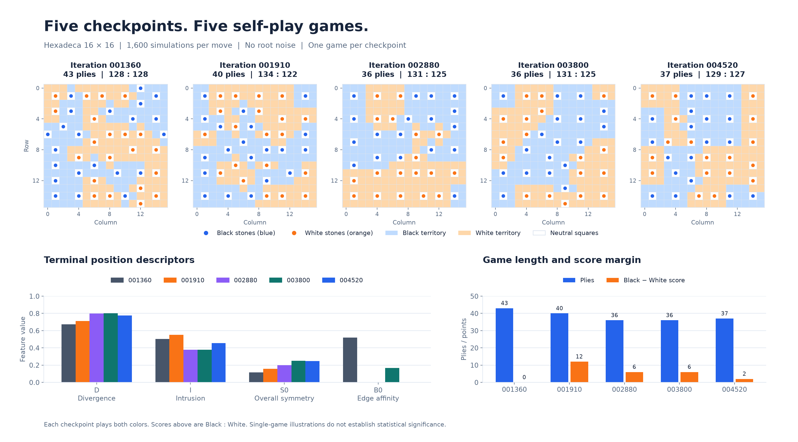
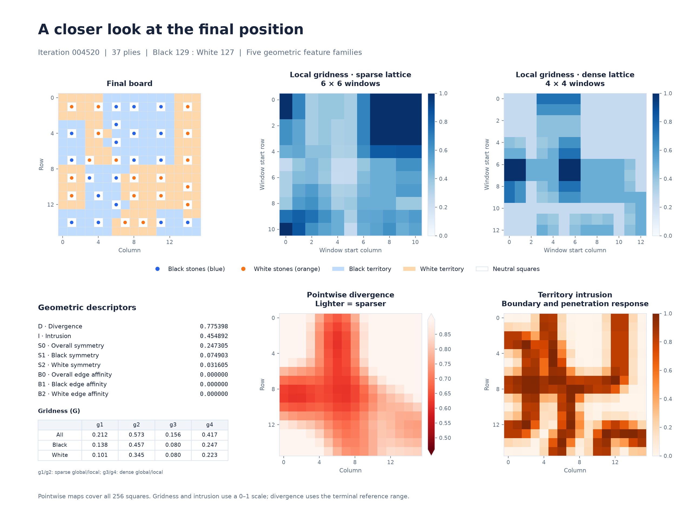
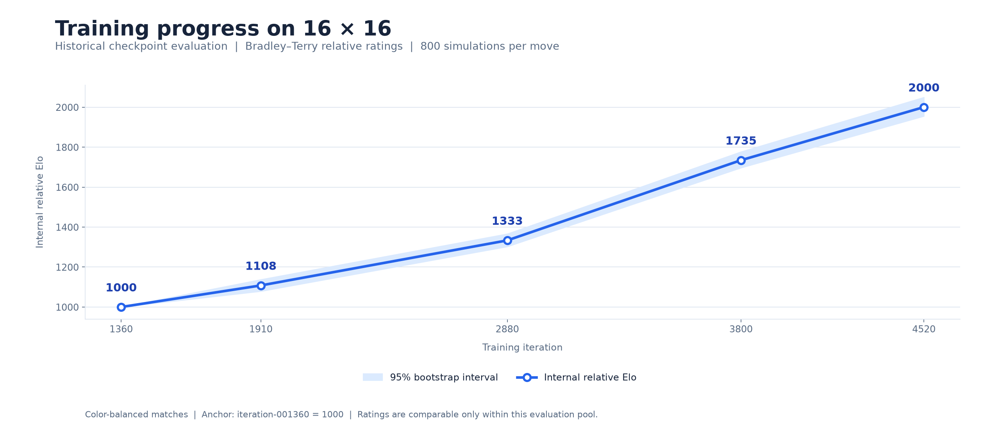

# Hexadeca

**An original board game and a research project in computer game AI.**

Hexadeca is a deterministic 16×16 spatial strategy game, with an experimental platform spanning the rules engine, neural networks, Monte Carlo tree search, self-play training, and match evaluation. Its geometric move constraints and distance-layer scoring provide a concrete setting for studying game AI through reproducible experiments.

## The game

- A finite, non-wrapping **16×16 board**. Black moves first; players alternate.
- Each move places one stone on an empty square. Stones never move, capture, or replace other stones.
- A legal square must have Chebyshev distance greater than 1 from every existing stone. Each stone blocks its own square and its eight in-bounds neighbors, regardless of color.
- **Deterministic, perfect information:** no random events, hidden information, passes, or simultaneous moves.
- The game ends immediately when no legal move remains.
- All 256 squares, including occupied squares, are scored. The first Euclidean distance layer containing unequal numbers of Black and White stones determines a square's owner; if every layer ties, the square is neutral. The higher total score wins.
- **256 possible action locations** and a theoretical maximum of **64 plies**, bounded by a partition into 2×2 blocks.

See the [formal rules](docs/rules/hexadeca-v1.md). The public implementation targets the fixed `hexadeca-v1` ruleset.

## AI system

The current 16×16 implementation includes:

- **Policy Network:** 256 action logits, with legal-move masking during search.
- **Value Network:** outcome prediction for the player to move and normalized final scores for both sides.
- A residual CNN backbone and D4 data augmentation.
- **MCTS / PUCT**, **First Play Urgency (FPU)**, and **Virtual Loss**.
- **Batch Leaf Selection** and **batched inference**.
- Dirichlet root noise and temperature sampling for self-play exploration.
- Replay data, AdamW training, and checkpoint management.
- C++20 native kernels for board operations, scoring, features, and search, alongside Python implementations.
- **Self-play**, color-balanced matches, confidence intervals, and relative Elo evaluation.

The exact endgame module solves win/draw/loss outcomes for positions with few remaining moves; the full 16×16 game is not solved. Five 16×16 checkpoints used in the showcase below are available through Git LFS. Replay buffers and experiment run directories are excluded.

## Quick demo: no retraining required

Install Git LFS, Python 3.11–3.13, and C++20 build tools, then run in a POSIX shell (Git Bash on Windows):

```bash
git clone https://github.com/srotn/hexadeca.git
cd hexadeca
bash scripts/download-checkpoints.sh
bash scripts/quickstart.sh iteration-004520
```

Open **http://localhost:5555** once the server starts. The helper creates a virtual environment and installs dependencies as needed, then loads the checkpoint for interactive evaluation. It does not start a training job.

Available checkpoints: `iteration-001360`, `iteration-001910`, `iteration-002880`, `iteration-003800`, and `iteration-004520`. Weights and original training state total approximately **191 MB**. See [CHECKPOINTS.md](CHECKPOINTS.md) for requirements, checkpoint and port selection, and troubleshooting.

## Visual results

The board and feature panels show one illustrative game per historical checkpoint under a fixed demonstration protocol. The Elo chart uses a separate, previously completed match evaluation.

### Five checkpoints, five terminal positions

Each checkpoint plays both sides of **one game**, with **1,600 simulations per move** and **no root noise**. Blue represents Black; orange represents White. Dots are stones and shaded squares show scoring ownership. Below the boards are four scalar descriptors from the five feature families, game lengths, and final score margins. These five games illustrate differences; they do not establish statistical significance.

<p align="center">
  
</p>

### Example terminal analysis

The `iteration-004520` example ends after **37 plies**, with **Black 129 – White 127**. The figure combines the final board, local gridness maps, pointwise divergence and intrusion maps, and the five feature families: divergence (D), gridness (G), intrusion (I), symmetry (S), and edge affinity (B). These are project-specific geometric descriptors.

<p align="center">
  
</p>

### Internal relative Elo

Ratings come from the existing 16×16 checkpoint round-robin evaluation, using **800 simulations per move** and **color-balanced matches**. Points are Bradley–Terry relative ratings; shading shows **95% bootstrap intervals**, with `iteration-001360` anchored at **1000**. This is an internal comparison scale, not comparable to chess, Go, or other games' ratings.

<p align="center">
  
</p>

The [figure renderer](docs/assets/render_showcase.py) and [curated source data](docs/assets/showcase-data.json) reproduce these figures without rerunning self-play or evaluation. Rendering requires Matplotlib; it is not needed to launch the demo.

## Complexity at a glance

These figures are combinatorial counts and structural analyses under the current `hexadeca-v1` rules. They are not runtime benchmarks or measurements from enumerating every state.

| Quantity | Result |
|---|---:|
| Maximum game length | 64 plies |
| Action space | 256 |
| Reachable colored states | ≈ 1.56896 × 10^46 |
| Uncolored legal occupied-set states | ≈ 4.42220 × 10^34 |
| Full game-tree history nodes | ≈ 2.04243 × 10^104 |
| State-space information complexity | ≈ 153.46 bits |
| Game-tree information complexity | ≈ 346.51 bits |
| State-space peak | 44 plies |
| Peak states at 44 plies | ≈ 2.09534 × 10^45 |
| Game-tree peak | 63 plies |
| Opening branching factor | 256 |
| Effective average branching factor | ≈ 42.63 |

The state-space peak and game-tree peak occur at different depths: around 44 plies for distinct states and around 63 plies for historical game-tree nodes.

Selected late-game layers are approximately:

| Layer | States |
|---|---:|
| ≤1 ply from theoretical maximum | ≈ 2.896 × 10^34 |
| ≤4 plies | ≈ 2.175 × 10^38 |
| ≤8 plies | ≈ 6.304 × 10^41 |
| ≤10 plies | ≈ 1.127 × 10^43 |
| ≤12 plies | ≈ 1.112 × 10^44 |
| ≤16 plies | ≈ 2.373 × 10^45 |
| 64-piece terminal-layer states | ≈ 4.673 × 10^32 |

See [the complexity notes](docs/complexity.md) for definitions, counting conventions, and limitations.

## Installation

Use Python 3.11–3.13 and a virtual environment. The editable build compiles the native extension, so C++20 build tools and Python development headers must be available.

```bash
python -m venv .venv
source .venv/bin/activate
python -m pip install --upgrade pip
python -m pip install -e ".[dev]"
```

To rebuild the C++20 acceleration extension explicitly:

```bash
python setup.py build_ext --inplace --force
```

The source tree also provides Python implementations for rules tests, network tests, and CPU experiments when native acceleration is unavailable.

## Validation

```bash
python -m pytest tests/test_board.py tests/test_environment.py tests/test_scoring.py
python -m pytest
```

See the [architecture guide](docs/architecture.md) for module responsibilities. Test, formatting, and type-checking settings live in the project configuration. CUDA availability, native build tools, and the PyTorch version affect which experiments can run.

## Repository layout

```text
benchmark/   Rules, network, search, self-play, and training benchmarks
checkpoints/ Five 16×16 checkpoint bundles published through Git LFS
config/      16×16 rules and training configuration
cpp/         C++20 acceleration kernels
docs/        Rules, complexity, architecture, and showcase figures
game/        Board operations, termination, and scoring
mcts/        PUCT, nodes, policies, and endgame search
monitoring/  Interactive monitoring UI and server
network/     Input features, residual network, policy, and losses
native/      Python interface to the native extension
scripts/     Checkpoint download and quickstart helpers
tests/       Rules, search, network, training, and evaluation tests
training/    Self-play, replay, training, and match evaluation
utils/       Shared utilities
```

## Research status and scope

This is a research-oriented open-source project supporting training and self-play experiments. It makes no claim of game-theoretically optimal play, absolute human-level strength, or generalization across rulesets. Elo values are relative to this project's evaluation pool. Apart from the five published checkpoints, 20×20 experiments, other training artifacts, historical logs, and local run directories are outside the scope of this 16×16 release.

## License

Released under the [MIT License](LICENSE).
