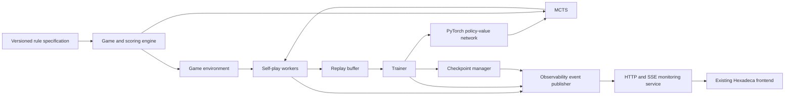

# Hexadeca AlphaZero - Stage 1 Design

## 1. Purpose and scope

This document is the implementation contract for the Hexadeca AlphaZero
project. It records the rules, architecture boundaries, data contracts,
quality gates, and staged delivery plan that are known at the beginning of
the project. It contains no implementation code.

The project priorities are, in order:

1. Correctness.
2. Maintainability.
3. Performance.
4. Development speed.

The system is an AlphaZero-style learner. It uses neural-network-guided MCTS
and self-play. It must not use rollout simulations or a hand-written position
evaluation function.

The authoritative game engine is separate from the user interface. The
browser visualizes state supplied by the engine; it never determines legal
moves, terminal status, score, or winner.

## 2. Canonical game specification

### 2.1 Board and players

- The board is a square 16 by 16 grid. Rows and columns are zero-based in the
  range `[0, 15]`.
- Black moves first. Players alternate turns: Black, White, Black, and so on.
- A cell has one of three states: empty, Black stone, or White stone.
- Stones are never captured, moved, or removed during a game.
- The action space has exactly 256 placement actions. The canonical action
  index is `row * 16 + column`; this mapping is part of the ruleset version.

### 2.2 Legal placement

For a candidate cell `(r, c)`:

1. It must be empty.
2. No existing stone may lie in the 3 by 3 neighbourhood centred at `(r, c)`.
   Equivalently, for every existing stone `(sr, sc)`,
   `max(abs(r - sr), abs(c - sc)) > 1`.

The first Black move is therefore unrestricted except that it must be on the
board. There is no pass action. A player with no legal placement ends the game
immediately; the other player does not receive an extra turn.

The rule implies a maximum of 64 placed stones on a 16 by 16 board, though a
game can terminate with fewer stones.

### 2.3 Terminal state and forbidden points

The game is terminal exactly when its legal-action set is empty. At that time,
every empty cell is a *forbidden point*. Every board cell, including forbidden
points and occupied cells, participates in final scoring. An occupied cell has
its own stone in the distance-zero layer and is therefore normally worth one
point to that stone's colour.

### 2.4 Distance-layer scoring

For every board cell `x`, form distance layers from all placed stones:

1. Compute squared Euclidean distance
   `d2(x, s) = (x.row - s.row)^2 + (x.column - s.column)^2` for every stone
   `s`. Squared distance is exact for ordering and avoids floating-point
   arithmetic.
2. Group stones by equal `d2` and inspect those groups in increasing `d2`
   order.
3. For the first group whose Black count `B` differs from its White count
   `W`:
   - if `B > W`, add `B` points to Black;
   - if `W > B`, add `W` points to White.
4. If `B == W`, inspect the next distance layer.
5. If all layers have equal Black and White counts, the point gives neither
   player a score.

The initial layer normally contains one nearest stone and therefore awards one
point. The multiplicity rule is important: if a nearest layer has two Black
stones and one White stone, the forbidden point contributes **two** points to
Black, not one.

The final result is the sum of all forbidden-point contributions. Black wins
when `black_score > white_score`; White wins when the reverse is true; equal
scores are a draw. This rule is immutable within a ruleset version.

### 2.5 Rule examples that must become test fixtures

- On an empty board, all 256 cells are legal; Black starts.
- After a stone at `(r, c)`, its own cell and all in-bounds Chebyshev-distance
  one neighbours are illegal.
- A position with no legal cell is terminal even if its next player has never
  placed a stone.
- A forbidden point with a unique nearest Black stone awards one Black point.
- A closest layer containing two Black stones and one White stone awards two
  Black points.
- Equal-colour-count closest layers are skipped before considering a farther
  layer.
- A point whose every layer has equal Black and White counts awards zero.
- Score calculation is invariant under stone insertion order and includes
  occupied cells.

## 3. Existing frontend assessment

The repository currently contains only `Hexadeca.html`; it is an untracked
prototype. Its visual style, board interaction, player controls, training tab,
and HTTP/SSE integration shape are assets to preserve in Stage 13.

Its present JavaScript must not be used as a game-rule authority. In
particular, its `cv()` function correctly considers every board cell, including
occupied cells, but awards one point to a side rather than the required count
of majority-colour stones in the decisive distance layer. Its displayed result
therefore still conflicts with the canonical rules above. Stage 13 will make
only targeted UI changes so displayed authoritative data comes from the
backend. Any live territory rendering before terminal status will be labelled
and treated as a non-authoritative preview, not an official score.

## 4. Architecture principles

### 4.1 Dependency direction

Lower layers have no dependency on browser code, HTTP, process management, or
training orchestration. The game engine has no dependency on PyTorch. The
network has no dependency on MCTS. This preserves the ability to add rules,
networks, scoring functions, and search implementations by extension.

### 4.2 Rule specification and compatibility

All tuneable values will be loaded from version-controlled configuration.
Rule-defining values, including board size, neighbourhood radius, distance
metric, score tie-break semantics, player order, and action mapping, are
stored in a versioned ruleset configuration rather than dispersed constants.

A checkpoint records its ruleset identifier, feature-schema identifier,
network architecture, and action-space size. Loading is rejected when one of
these is incompatible. This prevents a model trained under one game definition
from silently being used for another.

### 4.3 Canonical state model

The implementation will use one canonical, serializable state representation:

| Field | Meaning |
| --- | --- |
| `ruleset_id` | Immutable game-rule and action-encoding version. |
| `board` | 16 by 16 cell state with values empty, Black, or White. |
| `to_play` | Player required to move in a non-terminal state. |
| `move_history` | Ordered legal placements, sufficient for undo and features. |
| `ply` | Number of placed stones. |
| `zobrist_hash` | Incrementally maintained state identity; must include side to play. |

Derived values, such as legal mask, terminal state, score, and winner, are not
independently mutable. They are recomputed or cached under explicit invalidation
rules so a state cannot contain contradictory data.

### 4.4 Error and lifecycle policy

- Public boundaries validate configuration, state shapes, action range,
  ruleset compatibility, and checkpoint metadata before work begins.
- A rejected action does not mutate a game state.
- `apply` followed by `undo` restores all observable state, including player,
  history, legal-move cache, and hash.
- Errors use typed domain exceptions at library boundaries and structured logs
  at process boundaries. Training must fail clearly rather than continue with
  corrupt replay data or incompatible checkpoints.
- Seed values and determinism settings are recorded in every run manifest.
  GPU training is only reproducible to the degree documented by the selected
  PyTorch/CUDA operations.

## 5. ML and search design

### 5.1 Feature schema: `hexadeca-v1-16p`

The network receives a `16 x 16 x 16` tensor with channels ordered as follows.
Historical positions use an all-zero plane when unavailable.

| Planes | Content |
| --- | --- |
| 0-1 | Current Black occupancy; current White occupancy. |
| 2 | Current legal-action mask. |
| 3 | Side-to-play plane: all one for Black, all zero for White. |
| 4-5 | Black and White occupancy one ply earlier. |
| 6-7 | Black and White occupancy two plies earlier. |
| 8-9 | Black and White occupancy three plies earlier. |
| 10-11 | Black and White occupancy four plies earlier. |
| 12-13 | One-hot last move by Black; one-hot last move by White. |
| 14-15 | Row and column coordinates normalized to `[-1, 1]`. |

Feature construction belongs to the network/input layer, never to the browser
or replay API. All feature planes are documented and versioned with each
checkpoint. The exact tensor layout at the PyTorch boundary is `NCHW`.

### 5.2 Policy-value network

The initial model family is a configurable residual CNN with a 16 by 16 input,
10 to 12 residual blocks, and 128 channels. It has a shared trunk and three
heads:

- **Policy:** 256 logits, one for each canonical action. Legal masking happens
  in the loss and in MCTS before normalization; the model itself always emits
  256 logits.
- **Score:** Black-score and White-score predictions. Training retains raw
  final scores for reporting and predicts scores normalized by the conservative
  ruleset bound `board_cells * maximum_stones` (16,384 for the current
  ruleset). The normalizer is checkpoint metadata, not an implicit constant.
- **Outcome:** a scalar probability that the player in the input state wins.
  Targets are 1.0 for a win, 0.0 for a loss, and 0.5 for a final draw. MCTS
  converts it to current-player value `2 * probability - 1`.

Mixed precision is permitted for GPU execution but all correctness-sensitive
masking, terminal reward construction, and checkpoint metadata validation
remain numerically safe and explicitly tested.

### 5.3 Training objective

For self-play position `s`, visit distribution `pi`, outcome target `z`, and
normalized final scores `sb` and `sw`, the configurable total loss is:

`L = w_policy * CE(masked_policy, pi) + w_win * BCE(win, z) +`
`    w_black_score * MSE(pred_black, sb) +`
`    w_white_score * MSE(pred_white, sw) + L2`

`L2` is provided by AdamW's configured decoupled weight decay and must not be
silently applied a second time. Loss weights, clipping, optimizer settings,
and scheduler settings live in training configuration. The requested initial
optimizer is AdamW with learning rate `3e-4`, batch size 256, replay capacity
200,000 positions, and a scheduler selected through configuration.

### 5.4 MCTS

Each node represents a canonical game state and only exposes legal children.
Selection uses PUCT:

`selection = Q + c_puct * P * sqrt(parent_visits) / (1 + child_visits)`

The default `c_puct` is 2.3. Expansion obtains masked policy priors and a
value from the neural network. Leaf evaluation never performs a rollout and
does not use a manually written heuristic. Backup changes the value perspective
at every player transition.

Training self-play uses 800 simulations per move; evaluation and match play
use 1,600. At the root during training, legal priors receive Dirichlet noise
with concentration 0.15. The sampling temperature is 1 for plies 0 through
14 and 0 thereafter. At temperature zero, the chosen action is deterministic
with a documented stable action-index tie-break.

Virtual loss, parallel search, batched inference, memory pools, and any
transposition table must preserve serial-search semantics. They will first be
validated by deterministic test vectors and then enabled behind configuration.

The requested Dirichlet mixing weight and the virtual-loss magnitude have not
been specified. They are required configuration decisions before Stage 7; no
default will be assumed.

### 5.5 Replay, self-play, and checkpoints

The replay buffer is a bounded ring of 200,000 *positions*, not games. A
stored position contains the compact canonical state/history needed to rebuild
the feature tensor, its 256-element root visit distribution, final outcome
from the position player's perspective, final raw scores, and ruleset/feature
schema identifiers. It is fully populated only after the game terminates.

Self-play workers generate games with the active candidate model, record the
root visit distribution before action sampling, then append finalized examples
atomically. The trainer samples only valid, compatible examples and publishes a
new immutable checkpoint after its validation gates pass.

A checkpoint includes model parameters, optimizer state, scheduler state,
iteration, RNG states where possible, configuration snapshot, ruleset and
feature schema, metrics, and parent/checkpoint provenance. Replay persistence
is optional and separately configurable because it materially affects restart
time and disk usage. `latest` supports crash recovery; `best` changes only
after the evaluation gate accepts a candidate.

## 6. Configuration, observability, and reproducibility

Configuration is layered: immutable ruleset, repository defaults, named run
profile, and explicitly recorded runtime overrides. A validated merged
configuration is written to the run directory before training starts. Secrets
are injected only through environment variables or a deployment secret store
and are never committed.

Structured logs include UTC timestamp, run ID, process/worker ID, component,
event name, level, and error context. Separate files retain training,
self-play/MCTS (optional and rate-limited), benchmark, and error output.

Metrics have an extensible envelope with a schema version, sequence number,
UTC timestamp, run ID, event type, and typed payload. The initial payload set
will cover iteration, game count, replay size/capacity, total/policy/win/Black
score/White-score losses, policy entropy, learning rate, batch count,
simulation count, elapsed time, ETA, candidate/best checkpoint identifiers,
and CPU/RAM/GPU memory/utilization where the host exposes them. Missing hardware
telemetry is represented as unavailable, never fabricated as zero.

## 7. Quality strategy

Tests are organized by observable contract rather than implementation detail.

| Layer | Required verification |
| --- | --- |
| Rules and board | Legal-mask, apply/undo, history, turn, hash, terminal, bounds, and invalid-action tests. |
| Scoring | Exact distance-layer golden cases, multiplicity, ties, occupied-cell inclusion, symmetry, and order-independence tests. |
| Environment | `reset`, `step`, rewards/result, serialization, and self-play target tests. |
| Network | Feature-schema, output shape, legal-mask, CPU/GPU forward, loss, and checkpoint-compatibility tests. |
| MCTS | PUCT selection, expansion, perspective-correct backup, deterministic seeded search, batching, and virtual-loss tests. |
| Training | Replay capacity/compatibility, resume, checkpoint atomicity, and a short deterministic smoke run. |
| Service | Event schema, reconnect/snapshot recovery, read-only status, control authorization, and frontend contract tests. |

Benchmarks are versioned scripts that report platform, configuration, commit,
warm-up policy, iteration count, median, percentile, and throughput. No
performance claim is accepted without a baseline and reproducible command.
Stage 3 benchmarks board creation, apply/undo, and legal generation; Stage 4
benchmarks scoring; later stages benchmark search, inference throughput, replay
throughput, and end-to-end self-play. Targets are recorded only after the
reference implementation establishes a measured baseline.

Linting, formatting, type checking, tests, and documentation checks run in CI.
The initial CI platform is CPU Linux; GPU-specific tests are separately marked
and run on a CUDA-capable runner or deployment validation host. A broken
quality gate blocks stage completion and a commit must always be runnable.

## 8. Performance evolution

Python owns orchestration, configuration, data pipelines, training, and the
first correctness reference for game/search logic. PyTorch owns GPU execution,
automatic mixed precision, distributed data parallelism, CUDA streams, and
batch inference.

The project will not pre-emptively replace all logic with C++. Stage 12 begins
with profiler evidence. Only confirmed hot paths move to a C++20 extension via
pybind11, beginning with the most expensive validated operation. Candidate
paths are board mutation, legal generation, final scoring, Zobrist hashing,
MCTS node allocation/search, replay storage, SIMD kernels, and parallel search.

Every accelerated component must satisfy the same generated state/action test
corpus as the Python reference before it can be enabled. Native memory uses
RAII, bounded pools, sanitizers in development, and explicit Python ownership
rules. GPU batch inference remains centralized so CPU workers do not create
one GPU call per simulation.

## 9. Cloud training and monitoring design (Stage 13)

### 9.1 Service boundary

The training process remains the exclusive owner of self-play, MCTS, replay,
training, checkpointing, and metrics. A lightweight backend service exposes
state snapshots, authorized control requests, checkpoint/log metadata, and an
append-only stream of monitoring events. The frontend renders only these
records.

SSE is selected for the initial implementation because the existing frontend
already uses `EventSource` and monitoring traffic is server-to-browser. HTTP
handles start, pause, resume, stop, checkpoint, and log-download commands.
This meets the stated SSE alternative while minimizing changes to the existing
frontend. SSE events have monotonically increasing IDs; reconnects send
`Last-Event-ID`, replay retained events when possible, and otherwise receive a
full current snapshot. Browser-side reconnect backoff is capped and visible
connection state is derived from the stream, not guessed.

### 9.2 Monitoring contract

Events are schema-versioned and use the metric envelope in Section 6. Required
event categories are `snapshot`, `training_state`, `iteration_started`,
`self_play_move`, `iteration_completed`, `evaluation_completed`,
`checkpoint_created`, `warning`, and `error`. A self-play-move payload carries
board, ply, player to act, last action, legal-mask availability, recommended
move when available, completed simulation count, and search elapsed time.

The current frontend endpoint shapes (`/api/play/move`, `/api/train/start`,
`/api/train/stop`, `/api/train/events`, `/api/status`, and checkpoint routes)
are a compatibility input, not an implemented backend contract today. Stage 13
will preserve them where their semantics remain valid, add pause/resume and
recovery semantics, and validate the final API contract by tests before the UI
is changed. The frontend must continue to work as an interactive play surface
while all authoritative results originate in the backend.

### 9.3 Public deployment

The target host is an NVIDIA RTX 5090 server. Deployment will use Docker
Compose, bind the monitoring service to port 5555, mount persistent model,
replay, log, and run directories, and use NVIDIA Container Toolkit GPU
reservation. The deployment preflight checks the NVIDIA driver, CUDA/PyTorch
compatibility, disk space, writable persistent volumes, and checkpoint
integrity before a long run begins.

Port 5555 must not expose training controls anonymously. The service requires
authentication for all control and log-download operations; public deployment
uses TLS through a reverse proxy or an equivalent secure ingress. Authentication
secrets are external deployment configuration. Health checks, restart policy,
bounded event retention, log rotation, and graceful shutdown are mandatory for
multi-week runs.

## 10. Stage plan and acceptance gates

| Stage | Scope | Exit evidence |
| --- | --- | --- |
| 1 | Requirements and design only. | This document reviewed; no production code written. |
| 2 | Repository skeleton, configuration, logs, test framework, CI. | Lint/type/test/CI smoke gates pass. |
| 3 | Board engine: state, placements, undo, legal moves, history. | Unit tests and board benchmarks pass. |
| 4 | Terminal scoring and tie-break. | Golden scoring tests and score benchmark pass. |
| 5 | Environment APIs for play and self-play. | Environment integration tests pass. |
| 6 | Configurable PyTorch residual policy-value network. | CPU/GPU shape/loss/checkpoint tests pass. |
| 7 | Neural MCTS with PUCT, batching, virtual loss. | Search correctness and benchmark gates pass. |
| 8 | Replay buffer, loader, checkpoint manager. | Persistence/resume tests pass. |
| 9 | Multiprocess self-play. | Isolation, determinism, and throughput tests pass. |
| 10 | Trainer, AMP, TensorBoard, checkpoint lifecycle. | End-to-end smoke training/resume passes. |
| 11 | Arena and Elo evaluation. | Reproducible model-comparison run passes. |
| 12 | Profile-guided optimization and native extension. | Parity corpus and before/after benchmarks pass. |
| 13 | Cloud deployment and real-time monitoring. | Reconnect, authorization, recovery, and long-run operational tests pass. |

No stage begins until the user accepts the previous stage. Every completed
stage reports its changes, test results, applicable benchmark results, known
issues, and the plan for the next stage. Commits are made only when the stage
is runnable and its required checks pass.

## 11. Deferred decisions requiring explicit confirmation

The following choices are intentionally not guessed. They are not blockers for
the Stage 1 design, but must be decided before their implementation stages:

1. The Dirichlet root-noise mixing weight and the virtual-loss amount (before
   Stage 7).
2. Scheduler family and schedule parameters (before Stage 10).
3. Candidate-versus-best promotion threshold, arena game count, and Elo policy
   (before Stage 11).
4. Deployment domain/TLS provider and authentication mechanism (before Stage
   13).
5. Replay-buffer persistence policy for production restarts (before Stage 8).
